# 📊 Airbnb Clone Database Schema

데이터베이스 스키마 및 ERD(Entity Relationship Diagram) 문서입니다.

## 🗂️ 테이블 목록

| 카테고리 | 테이블명 | 설명 |
|----------|----------|------|
| 사용자 | users | 사용자 계정 정보 |
| 사용자 | user_profile | 사용자 프로필 상세 |
| 숙소 | listings | 숙소 기본 정보 |
| 숙소 | hosts | 호스트 정보 |
| 숙소 | property | 숙소 유형 |
| 객실 | locations | 위치 정보 |
| 객실 | room_types | 객실 유형 |
| 객실 | room_options | 객실 옵션 |
| 객실 | categories | 카테고리 |
| 객실 | rooms | 객실 정보 |
| 객실 | room_images | 객실 이미지 |
| 예약 | bookings | 예약 정보 |
| 예약 | reservation | 예약 상세 |
| 채팅 | conversations | 1:1 대화방 |
| 채팅 | messages | 메시지 |
| 챗봇 | chatbot | AI 챗봇 |
| 챗봇 | chatbot_session | 챗봇 세션 |
| 챗봇 | chatbot_logs | 챗봇 로그 |
| 챗봇 | chat_messages | 챗봇 메시지 |
| 리뷰 | reviews | 리뷰 |
| 위시리스트 | wishlists | 위시리스트 |
| 위시리스트 | wishlists_listings_listing | 위시리스트-숙소 연결 |

---

## 📐 ERD (Entity Relationship Diagram)

```mermaid
erDiagram
    %% ========== 사용자 ==========
    users {
        uuid id PK
        varchar email UK
        varchar password
        varchar githubId
        varchar name
        varchar avatarUrl
        text roles
        varchar provider
        timestamp createdAt
        timestamp updatedAt
    }
    
    user_profile {
        serial profile_id PK
        int user_id FK,UK
        varchar image_name
        text path
        text introduction_text
        text location
        varchar language
        text job
        text status
        timestamp created_at
        timestamp updated_at
    }
    
    users ||--o| user_profile : "has"

    %% ========== 숙소 ==========
    listings {
        uuid id PK
        varchar title
        text description
        varchar type
        varchar address
        decimal latitude
        decimal longitude
        text images
        json amenities
        int maxGuests
        int basePrice
        int weekendPrice
        boolean smartPricingEnabled
        json priceConfig
        uuid hostId FK
        timestamp createdAt
        timestamp updatedAt
    }
    
    hosts {
        serial host_id PK
        varchar host_name
        varchar identity_verified
        int listing_count
    }
    
    property {
        serial property_id PK
        varchar property_name
        text status
        timestamp created_at
        timestamp updated_at
    }
    
    users ||--o{ listings : "hosts"

    %% ========== 객실 ==========
    locations {
        serial location_id PK
        varchar location_name
        text description_location
        text description_traffic
        double lat
        double lng
        varchar neighbourhood
        varchar neighbourhood_group
    }
    
    room_types {
        serial room_types_id PK
        varchar types_name
        text status
        timestamp created_at
        timestamp updated_at
    }
    
    room_options {
        serial room_option_id PK
        int item1
        int item2
        int item3
        text status
        timestamp created_at
        timestamp updated_at
    }
    
    categories {
        serial category_id PK
        varchar category_name
        text status
        timestamp created_at
        timestamp updated_at
    }
    
    rooms {
        serial room_id PK
        varchar room_name
        varchar room_address
        int room_price
        int room_wishes
        text room_description
        time check_in_time
        time check_out_time
        text status
        int location_id FK
        int room_types_id FK
        int room_option_id FK
        int category_id FK
        timestamp created_at
        timestamp updated_at
    }
    
    room_images {
        serial image_id PK
        int room_id FK
        varchar image_name
        text path
        text status
        timestamp created_at
        timestamp updated_at
    }
    
    locations ||--o{ rooms : "contains"
    room_types ||--o{ rooms : "categorizes"
    room_options ||--o{ rooms : "configures"
    categories ||--o{ rooms : "groups"
    rooms ||--o{ room_images : "has"

    %% ========== 예약 ==========
    bookings {
        uuid id PK
        date checkIn
        date checkOut
        int guestCount
        int totalPrice
        enum status
        uuid guestId FK
        uuid listingId FK
        timestamp createdAt
        timestamp updatedAt
    }
    
    reservation {
        serial reservation_id PK
        timestamp check_in_date
        timestamp check_out_date
        int adults
        int childeren
        int infants
        int pets
        text status
        int room_id FK
        timestamp created_at
        timestamp updated_at
    }
    
    users ||--o{ bookings : "books"
    listings ||--o{ bookings : "receives"
    rooms ||--o{ reservation : "has"

    %% ========== 채팅 ==========
    conversations {
        uuid id PK
        varchar title
        uuid participant1Id FK
        uuid participant2Id FK
        timestamp lastMessageAt
        timestamp createdAt
    }
    
    messages {
        uuid id PK
        uuid conversationId FK
        uuid senderId FK
        text content
        boolean isRead
        timestamp createdAt
    }
    
    users ||--o{ conversations : "participates"
    conversations ||--o{ messages : "contains"
    users ||--o{ messages : "sends"

    %% ========== 챗봇 ==========
    chatbot {
        serial chatbot_id PK
        text message
        varchar intent
        text ai_answer
        int ticket_id
        varchar email
        text status
        timestamp created_at
        timestamp updated_at
    }
    
    chatbot_session {
        serial session_id PK
        timestamp started_at
        timestamp ended_at
        text status
        int chatbot_id FK
        int user_id
    }
    
    chatbot_logs {
        serial log_id PK
        text request_text
        text response_text
        text response_status
        float response_time
        int chatbot_id FK
        int session_id FK
        timestamp created_at
    }
    
    chat_messages {
        serial message_id PK
        text message_text
        varchar message_type
        boolean is_read
        text status
        int session_id FK
        int chatbot_id FK
        timestamp created_at
    }
    
    chatbot ||--o{ chatbot_session : "has"
    chatbot ||--o{ chatbot_logs : "logs"
    chatbot ||--o{ chat_messages : "contains"
    chatbot_session ||--o{ chatbot_logs : "records"
    chatbot_session ||--o{ chat_messages : "contains"

    %% ========== 리뷰 ==========
    reviews {
        serial review_id PK
        text content_text
        text status
        int star_point
        int room_id FK
        int user_id FK
        timestamp created_at
        timestamp updated_at
    }
    
    rooms ||--o{ reviews : "receives"

    %% ========== 위시리스트 ==========
    wishlists {
        uuid id PK
        varchar name
        uuid userId FK
        timestamp createdAt
        timestamp updatedAt
    }
    
    wishlists_listings_listing {
        uuid wishlistsId PK,FK
        uuid listingId PK,FK
    }
    
    users ||--o{ wishlists : "creates"
    wishlists ||--o{ wishlists_listings_listing : "contains"
    listings ||--o{ wishlists_listings_listing : "included_in"
```

---

## 🔗 주요 관계

### 사용자 관련
- `users` ↔ `user_profile`: 1:1 관계
- `users` → `listings`: 호스트로서 숙소 소유
- `users` → `bookings`: 게스트로서 예약
- `users` → `wishlists`: 위시리스트 소유
- `users` ↔ `conversations`: 채팅 참여

### 숙소/객실 관련
- `rooms` → `locations`: 위치 정보 참조
- `rooms` → `room_types`: 객실 유형 참조
- `rooms` → `categories`: 카테고리 참조
- `rooms` → `room_images`: 이미지 소유

### 예약 관련
- `bookings` → `users`: 게스트 참조
- `bookings` → `listings`: 숙소 참조
- `reservation` → `rooms`: 객실 참조

### 위시리스트 관련
- `wishlists` → `users`: 소유자 참조
- `wishlists_listings_listing`: 다대다 조인 테이블

---

## 📊 테이블 통계

| 항목 | 수량 |
|------|------|
| 총 테이블 수 | 21개 |
| UUID PK 테이블 | 7개 |
| SERIAL PK 테이블 | 14개 |
| 조인 테이블 | 1개 |
